# 🎲 Canoga - Android Mobile Game

Welcome to **Canoga** — a mobile adaptation of the classic board game!  
This app was developed using **Java** and **Android Studio** as part of a programming project.

---

## 📱 Game Overview

- Play the classic game of **Canoga**, also known as "**Shut the Box**."
- Roll the dice, select tiles that sum up to your roll, and try to shut all the tiles before your opponent!
- Designed with **simple, intuitive touch controls** for a smooth mobile experience.
- Built with a strong separation of Model-View-Controller (**MVC**) principles.


---

## 📸 Screenshots

| Welcome Screen | Load Game | Board Size Selection |
|:--------------:|:---------:|:--------------------:|
| 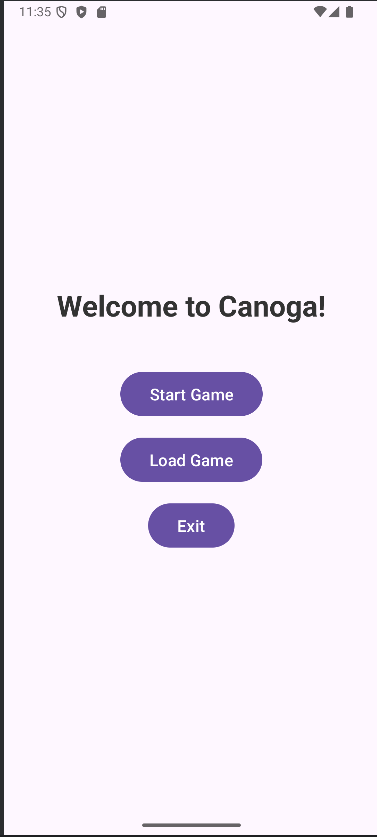 | 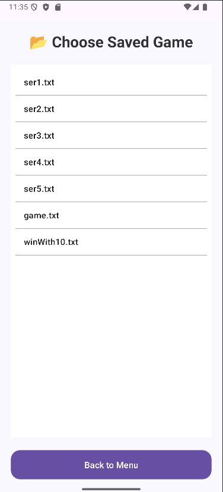 | 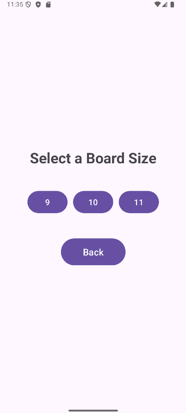 |

| Game Start | Manual Dice Roll | Move Selection |
|:----------:|:----------------:|:--------------:|
| 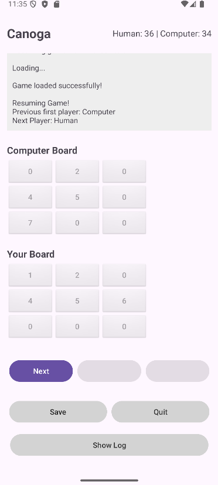 | 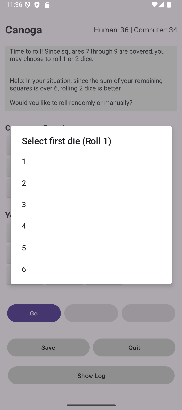 | 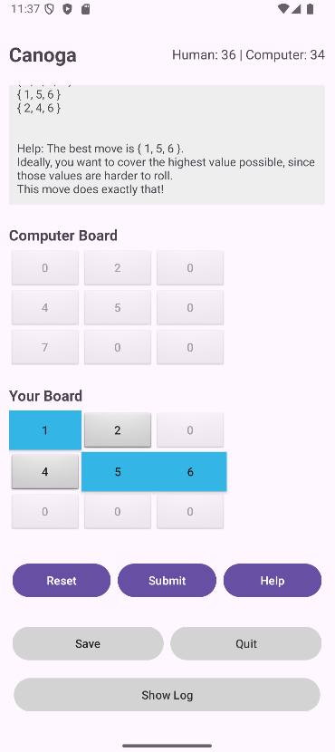 |

| Cover Help | Move Help | Game Win |
|:----------:|:---------:|:--------:|
| 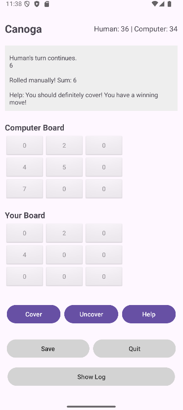 | 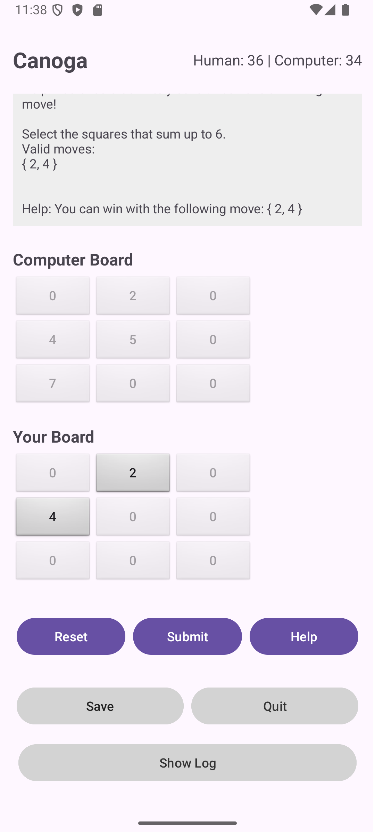 | 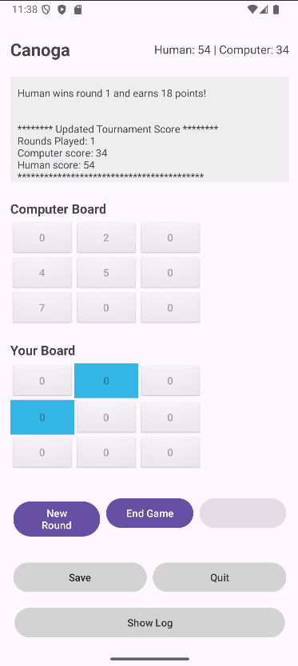 |

| New Game Menu | Game Log | Results Screen |
|:-------------:|:--------:|:--------------:|
| 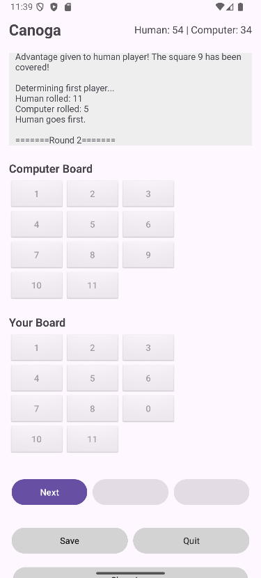 | 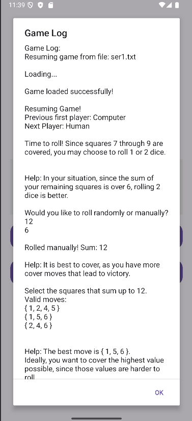 | 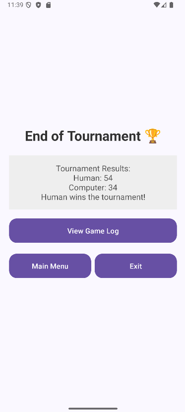 |


---

## 🛠️ Tech Stack

- **Java** — Core game logic and Android app development.
- **Android Studio** — Full project development environment.
- **XML Layouts** — User Interface (UI) design.
- **Internal Storage** — Saving and loading game states locally.

---

## 🎮 Features

- 🎲 **Interactive Game Board**: Tap tiles to select your moves.
- 🔄 **Dice Rolls**: Simulated dice rolling experience.
- 📜 **Move Log**: See your game actions recorded as you play.
- 💾 **Game Persistence**: Save your progress when you close the app.
- 📏 **Responsive UI**: Smooth performance across different Android devices.

---

## 🚀 How to Run

1. Clone this repository:
    ```bash
    git clone https://github.com/ECampbell37/Canoga_Java_Android.git
    ```
2. Open the project in **Android Studio**.
3. Connect an Android device or use an emulator.
4. Build and run the app!


---

## 📚 Acknowledgments

- Classic **Canoga/Shut the Box** rules and gameplay.
- Developed as part of my Organization of Programming Languages Course CMPS-366.

---

